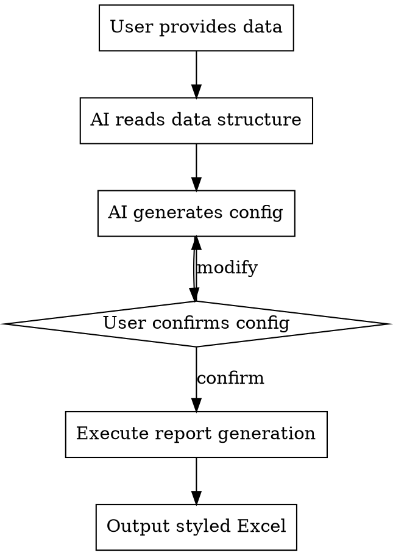

# Data Analysis Report

## Overview

Generate styled Excel reports with period-over-period comparisons (YoY/MoM) from multi-source data. AI analyzes data structure, generates configuration, and produces formatted output.

## When to Use

- User provides Excel file and requests analysis
- Need to compare data across periods (years, months)
- Require styled summary reports with totals

## Workflow



## Configuration Structure

AI generates a YAML config with these fields:

| Field | Description | Required |
|-------|-------------|----------|
| `data_source.type` | `multi_sheet` or `multi_file` | Yes |
| `data_source.path` | Path to Excel file | If multi_sheet |
| `data_source.sheets` | Sheet names for multi_sheet type | If multi_sheet |
| `data_source.files` | File paths for multi_file type | If multi_file |
| `key_column` | Column to merge on | Yes |
| `value_columns` | List of columns to analyze | Yes |
| `periods.current` | Current period label (for column names) | Yes |
| `periods.previous` | Previous period label (for column names) | Yes |
| `periods.current_file` | File name for current period | If multi_file |
| `periods.previous_file` | File name for previous period | If multi_file |
| `analysis` | Analysis types: `yoy`, `mom` | Yes |
| `output.dir` | Output directory | Yes |
| `output.title` | Report title | Yes |
| `group_by.column` | Column to group by (e.g., 督导人员) | No |
| `group_by.sheet_name` | Group summary sheet name | No |
| `group_by.metrics` | `auto` or list of metrics | No |
| `group_by.null_handling` | `ignore` or `unassigned` | No |

## Usage Example

**User:**
> 分析这份销售数据 @data.xlsx

**AI Response:**
1. Reads Excel structure
2. Identifies sheets: 2026, 2025
3. Identifies columns: 点位名称, 购买杯数, 销售金额
4. Generates config and asks confirmation:

```yaml
data_source:
  type: multi_sheet
  path: ./data/data.xlsx
  sheets: ['2026', '2025']   # Sheet names must be strings

key_column: 点位名称
value_columns:
  - name: 购买杯数
  - name: 销售金额

periods:
  current: '2026'            # Period labels must be strings
  previous: '2025'

analysis: [yoy]

output:
  dir: ./output
  title: 销售数据汇总
```

5. User confirms → Execute → Output report

## Group Summary (Optional)

When data has a grouping column (e.g., 督导人员), add `group_by` config:

```yaml
group_by:
  column: 督导人员           # Column to group by
  sheet_name: 督导人员汇总    # Output sheet name (default: "{column}汇总")
  metrics: auto             # auto = smart filter (columns with "总")
  null_handling: ignore     # ignore = skip nulls
```

**Smart Filter Logic:**
- `metrics: auto` → Filter value_columns for names containing "总" (e.g., 总杯数, 总金额)
- No match → Use all value_columns

**Output:**
- Without `group_by`: Single sheet (point summary)
- With `group_by`: Two sheets (point summary + group summary)

## Multi-File Example

For multiple Excel files:

```yaml
data_source:
  type: multi_file
  files:
    - ./data/销售汇总表-2026.03.xlsx
    - ./data/销售汇总表-2026.02.xlsx

key_column: 点位名称
value_columns:
  - name: 总杯数
  - name: 总金额

periods:
  current: '2026.03'
  previous: '2026.02'
  current_file: '销售汇总表-2026.03'
  previous_file: '销售汇总表-2026.02'

analysis: [yoy]

group_by:
  column: 督导人员
  metrics: auto

output:
  dir: ./output
  title: 月度销售环比分析
```

## Output Format

- Output directory: `./output/YYYYMMDD/` (grouped by date)
- File name: `{title}_HHMMSS.xlsx`
- Blue header row with white bold text
- Orange total row with bold text
- Percentage format for comparison columns
- Number format with thousands separator
- Auto-sized columns

## Script Location

`scripts/generate_report.py` - Core report generation logic

## Common Mistakes

| Mistake | Fix |
|---------|-----|
| Wrong key column | Verify column name matches exactly |
| Missing sheets | Check sheet names in Excel |
| N/A in all comparisons | Periods don't share common keys |
| Sheet names as numbers | Use quotes: `'2026'` not `2026` |

## Troubleshooting

| Error | Cause | Solution |
|-------|-------|----------|
| `KeyError: '2026'` | Sheet name not found | Verify sheet names match Excel exactly |
| `FileNotFoundError` | Invalid path | Check `data_source.path` is correct |
| All YoY values are N/A | No matching keys | Ensure both periods have same key values |
| `YAMLError` | Invalid YAML syntax | Check indentation and quotes |
| Group summary empty | Group column not found | Check `group_by.column` exists in data |
| Group summary missing rows | Null values in group column | Use `null_handling: unassigned` to include |
