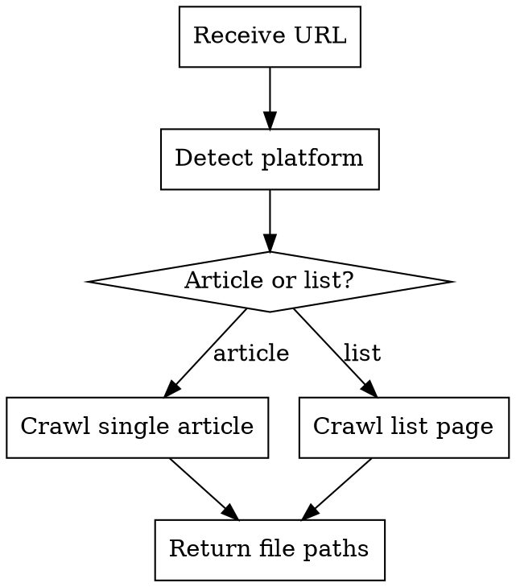

# URL to Markdown Crawler

## Overview

A tool to crawl web pages and convert to Markdown format. Automatically detects platform and page type (article vs list).

## When to Use

- User asks to "抓取这篇文章" or "crawl this URL"
- User provides a URL from WeChat, Zhihu, Jianshu, or generic websites
- User wants to batch download articles from a list page

## Supported Platforms

| Platform | Article Page | List Page |
|----------|--------------|-----------|
| 微信公众号 | ✅ | ✅ |
| 知乎专栏 | ✅ | ✅ |
| 简书 | ✅ | ✅ |
| 通用网页 | ✅ | ❌ |

## Usage

### Single Article

```python
from src.data_crawl import crawl_url

result = crawl_url(
    url="https://mp.weixin.qq.com/s/xxx",
    output_dir="misc/",
    download_images=False,
)
```

### List Page

```python
result = crawl_url(
    url="https://mp.weixin.qq.com/mp/profile_ext?...",
    output_dir="misc/",
    download_images=False,
    limit=10,
    delay=2.0,
)
```

## Parameters

| Parameter | Type | Default | Description |
|-----------|------|---------|-------------|
| `url` | str | required | Article or list page URL |
| `output_dir` | str | `"misc/"` | Output directory |
| `download_images` | bool | `False` | Download images locally |
| `limit` | int | None | Max articles for list page |
| `delay` | float | 2.0 | Request delay (seconds) |

## Return Value

```python
@dataclass
class CrawlResult:
    success: bool           # Whether crawl succeeded
    files: List[str]        # Generated file paths
    error: Optional[str]    # Error message if failed
    article_count: int      # Number of articles crawled
```

## Parameter Inference (Mixed Mode)

**Auto-infer for simple cases:**
- "抓这篇文章" → single article, default params
- "抓几篇文章" → list page, limit=5

**Ask user for complex cases:**
- "抓这个公众号所有文章" → ask: "要抓多少篇？需要下载图片吗？"

## Workflow



## Output Format

Tell user the file paths:

```
已保存到: misc/文章标题.md
```

For list pages:

```
已抓取 10 篇文章，保存到: misc/
```

## Common Issues

| Issue | Solution |
|-------|----------|
| Playwright not installed | Run: `pip install playwright && playwright install chrome` |
| Login required | User needs to provide cookies manually |
| Rate limited | Increase `delay` parameter |
