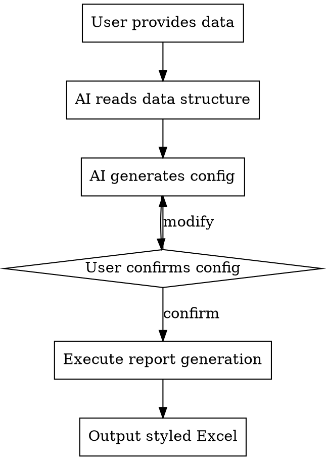

# Data Analysis Report Skill Implementation Plan

> **For agentic workers:** REQUIRED SUB-SKILL: Use superpowers:subagent-driven-development (recommended) or superpowers:executing-plans to implement this plan task-by-task. Steps use checkbox (`- [ ]`) syntax for tracking.

**Goal:** Create a reusable Superpowers Skill that generates styled Excel analysis reports from multi-period sales data with YoY/MoM comparison.

**Architecture:** Configuration-driven Python module wrapped as a Superpowers Skill. AI reads data structure, generates config via dialog, executes report generation script. Supports multi-sheet and multi-file Excel sources.

**Tech Stack:** Python, pandas, openpyxl, Superpowers Skill system

---

## File Structure

```
.opencode/skills/data-analysis-report/
├── SKILL.md                    # Skill documentation (required)
├── scripts/
│   └── generate_report.py      # Core report generation script
└── templates/
    └── config.yaml             # Configuration template
```

---

### Task 1: Create Skill Directory Structure

**Files:**
- Create: `.opencode/skills/data-analysis-report/SKILL.md`
- Create: `.opencode/skills/data-analysis-report/scripts/generate_report.py`
- Create: `.opencode/skills/data-analysis-report/templates/config.yaml`

- [ ] **Step 1: Create directory structure**

```bash
mkdir -p .opencode/skills/data-analysis-report/scripts
mkdir -p .opencode/skills/data-analysis-report/templates
```

- [ ] **Step 2: Verify directories created**

Run: `ls -la .opencode/skills/data-analysis-report/`
Expected: `scripts/` and `templates/` directories exist

---

### Task 2: Create Configuration Template

**Files:**
- Create: `.opencode/skills/data-analysis-report/templates/config.yaml`

- [ ] **Step 1: Write config template**

```yaml
# Data Analysis Report Configuration
# Generated by AI based on data structure analysis

# Data source configuration
data_source:
  type: multi_sheet          # multi_sheet | multi_file
  path: ./data/source.xlsx   # Excel file path
  sheets: []                 # Sheet names for multi_sheet type
  # files: []                # File paths for multi_file type

# Column configuration
key_column: 点位名称          # Column to merge on
value_columns:               # Columns to analyze
  - name: 购买杯数
    type: quantity
  - name: 销售金额
    type: currency

# Period configuration
periods:
  current: 2026              # Current period label
  previous: 2025             # Previous period label (YoY baseline)
  # last_period: 2026.02     # Last period label (MoM baseline, optional)

# Analysis types
analysis:
  - yoy                      # Year-over-year comparison
  # - mom                    # Month-over-month comparison (optional)

# Output configuration
output:
  dir: ./output
  title: 销售数据汇总
```

- [ ] **Step 2: Verify template syntax**

Run: `python -c "import yaml; yaml.safe_load(open('.opencode/skills/data-analysis-report/templates/config.yaml'))"`
Expected: No errors

---

### Task 3: Create Core Report Generation Script

**Files:**
- Create: `.opencode/skills/data-analysis-report/scripts/generate_report.py`

- [ ] **Step 1: Write complete script**

```python
#!/usr/bin/env python3
"""
Data Analysis Report Generator
Generates styled Excel reports with YoY/MoM analysis from multi-period data.
"""

import pandas as pd
import numpy as np
import sys
import os
import yaml
from pathlib import Path
from datetime import datetime
from openpyxl import Workbook
from openpyxl.utils.dataframe import dataframe_to_rows
from openpyxl.styles import Font, Alignment, PatternFill, Border, Side

sys.stdout.reconfigure(encoding='utf-8')


def load_config(config_path: str) -> dict:
    """Load configuration from YAML file."""
    with open(config_path, 'r', encoding='utf-8') as f:
        return yaml.safe_load(f)


def load_data(config: dict) -> dict:
    """Load data from Excel based on configuration."""
    data = {}
    ds = config['data_source']
    
    if ds['type'] == 'multi_sheet':
        xl = pd.ExcelFile(ds['path'])
        for sheet in ds['sheets']:
            data[sheet] = pd.read_excel(xl, sheet_name=sheet)
    elif ds['type'] == 'multi_file':
        for file_path in ds['files']:
            name = Path(file_path).stem
            data[name] = pd.read_excel(file_path)
    
    return data


def standardize_columns(df: pd.DataFrame, period: str, value_columns: list) -> pd.DataFrame:
    """Rename columns with period suffix."""
    key_col = df.columns[0]
    new_cols = {key_col: 'key'}
    for i, vc in enumerate(value_columns, 1):
        col_name = vc['name'] if isinstance(vc, dict) else vc
        new_cols[df.columns[i]] = f"{col_name}_{period}"
    return df.rename(columns=new_cols)


def merge_periods(data: dict, periods: dict, key_column: str, value_columns: list) -> pd.DataFrame:
    """Merge data from multiple periods."""
    current_df = standardize_columns(data[periods['current']], 'current', value_columns)
    previous_df = standardize_columns(data[periods['previous']], 'previous', value_columns)
    
    merged = current_df.merge(previous_df, on='key', how='outer')
    merged.rename(columns={'key': key_column}, inplace=True)
    
    return merged


def calc_comparison(current, previous):
    """Calculate comparison percentage. Returns 'N/A' if invalid."""
    if pd.isna(current) or pd.isna(previous) or previous == 0:
        return 'N/A'
    return (current - previous) / previous


def calculate_analysis(df: pd.DataFrame, value_columns: list, analysis_types: list, periods: dict) -> pd.DataFrame:
    """Calculate YoY/MoM comparisons."""
    for vc in value_columns:
        col_name = vc['name'] if isinstance(vc, dict) else vc
        current_col = f"{col_name}_current"
        previous_col = f"{col_name}_previous"
        
        if 'yoy' in analysis_types:
            df[f"{col_name}_yoy"] = df.apply(
                lambda row: calc_comparison(row[current_col], row[previous_col]), axis=1
            )
    
    return df


def add_totals(df: pd.DataFrame, key_column: str, value_columns: list, analysis_types: list) -> pd.DataFrame:
    """Add summary row at the end."""
    totals = {key_column: '总计'}
    
    for vc in value_columns:
        col_name = vc['name'] if isinstance(vc, dict) else vc
        current_col = f"{col_name}_current"
        previous_col = f"{col_name}_previous"
        
        current_total = df[current_col].sum()
        previous_total = df[previous_col].sum()
        
        totals[current_col] = current_total
        totals[previous_col] = previous_total
        
        if 'yoy' in analysis_types:
            totals[f"{col_name}_yoy"] = calc_comparison(current_total, previous_total)
    
    return pd.concat([df, pd.DataFrame([totals])], ignore_index=True)


def style_workbook(ws, value_columns: list, analysis_types: list):
    """Apply styling to worksheet."""
    header_fill = PatternFill(start_color='4472C4', fill_type='solid')
    header_font = Font(bold=True, color='FFFFFF')
    total_fill = PatternFill(start_color='FFC000', fill_type='solid')
    total_font = Font(bold=True)
    thin_border = Border(
        left=Side(style='thin'),
        right=Side(style='thin'),
        top=Side(style='thin'),
        bottom=Side(style='thin')
    )
    
    for col in range(1, ws.max_column + 1):
        cell = ws.cell(row=1, column=col)
        cell.fill = header_fill
        cell.font = header_font
        cell.alignment = Alignment(horizontal='center')
    
    yoy_cols = set()
    col_idx = 2
    for vc in value_columns:
        col_idx += 2
        if 'yoy' in analysis_types:
            yoy_cols.add(col_idx)
            col_idx += 1
    
    for row in range(2, ws.max_row + 1):
        for col in range(1, ws.max_column + 1):
            cell = ws.cell(row=row, column=col)
            cell.border = thin_border
            
            if col in yoy_cols:
                if cell.value != 'N/A' and cell.value is not None:
                    cell.number_format = '0.00%'
                cell.alignment = Alignment(horizontal='center')
            elif col > 1:
                cell.number_format = '#,##0'
                cell.alignment = Alignment(horizontal='right')
    
    for col in range(1, ws.max_column + 1):
        cell = ws.cell(row=ws.max_row, column=col)
        cell.fill = total_fill
        cell.font = total_font
    
    ws.column_dimensions['A'].width = 30
    for col_letter in ['B', 'C', 'D', 'E', 'F', 'G', 'H', 'I', 'J']:
        ws.column_dimensions[col_letter].width = 14


def generate_report(config_path: str) -> str:
    """Main function to generate report from config."""
    config = load_config(config_path)
    
    data = load_data(config)
    merged = merge_periods(
        data, 
        config['periods'], 
        config['key_column'], 
        config['value_columns']
    )
    
    result = calculate_analysis(
        merged, 
        config['value_columns'], 
        config['analysis'], 
        config['periods']
    )
    
    result = add_totals(
        result, 
        config['key_column'], 
        config['value_columns'], 
        config['analysis']
    )
    
    output_cols = [config['key_column']]
    for vc in config['value_columns']:
        col_name = vc['name'] if isinstance(vc, dict) else vc
        output_cols.extend([
            f"{col_name}_previous",
            f"{col_name}_current",
            f"{col_name}_yoy"
        ])
    
    result = result[output_cols]
    
    rename_map = {config['key_column']: config['key_column']}
    for vc in config['value_columns']:
        col_name = vc['name'] if isinstance(vc, dict) else vc
        prev_label = config['periods']['previous']
        curr_label = config['periods']['current']
        rename_map[f"{col_name}_previous"] = f"{prev_label}{col_name}"
        rename_map[f"{col_name}_current"] = f"{curr_label}{col_name}"
        rename_map[f"{col_name}_yoy"] = f"{col_name}同比"
    
    result.rename(columns=rename_map, inplace=True)
    
    wb = Workbook()
    ws = wb.active
    ws.title = config['output']['title']
    
    for r in dataframe_to_rows(result, index=False, header=True):
        ws.append(r)
    
    style_workbook(ws, config['value_columns'], config['analysis'])
    
    os.makedirs(config['output']['dir'], exist_ok=True)
    date_str = datetime.now().strftime('%Y%m%d_%H%M%S')
    output_file = f"{config['output']['dir']}/{config['output']['title']}_{date_str}.xlsx"
    wb.save(output_file)
    
    print(f"报表已生成: {output_file}")
    print(f"点位数量: {len(result) - 1}")
    
    return output_file


if __name__ == '__main__':
    if len(sys.argv) < 2:
        print("Usage: python generate_report.py <config.yaml>")
        sys.exit(1)
    
    generate_report(sys.argv[1])
```

- [ ] **Step 2: Test script syntax**

Run: `python -m py_compile .opencode/skills/data-analysis-report/scripts/generate_report.py`
Expected: No errors

---

### Task 4: Create SKILL.md Documentation

**Files:**
- Create: `.opencode/skills/data-analysis-report/SKILL.md`

- [ ] **Step 1: Write SKILL.md**

```markdown
---
name: data-analysis-report
description: Use when user provides Excel data and requests statistical analysis, comparison reports, or data summaries. Triggers on phrases like "分析数据", "生成报表", "同比分析", "汇总统计".
---

# Data Analysis Report

## Overview

Generate styled Excel reports with period-over-period comparisons (YoY/MoM) from multi-source data. AI analyzes data structure, generates configuration, and produces formatted output.

## When to Use

- User provides Excel file and requests analysis
- Need to compare data across periods (years, months)
- Require styled summary reports with totals

## Workflow



## Configuration Structure

AI generates a YAML config with these fields:

| Field | Description |
|-------|-------------|
| `data_source.type` | `multi_sheet` or `multi_file` |
| `data_source.path` | Path to Excel file |
| `data_source.sheets` | Sheet names for multi_sheet type |
| `key_column` | Column to merge on (e.g., 点位名称) |
| `value_columns` | Columns to analyze |
| `periods.current` | Current period label |
| `periods.previous` | Previous period label |
| `analysis` | Analysis types: `yoy`, `mom` |

## Usage Example

**User:**
> 分析这份销售数据 @data.xlsx

**AI Response:**
1. Reads Excel structure
2. Identifies sheets: 2026, 2025
3. Identifies columns: 点位名称, 购买杯数, 销售金额
4. Generates config and asks confirmation:

```yaml
data_source:
  type: multi_sheet
  path: ./data/data.xlsx
  sheets: [2026, 2025]

key_column: 点位名称
value_columns:
  - name: 购买杯数
  - name: 销售金额

periods:
  current: 2026
  previous: 2025

analysis: [yoy]

output:
  dir: ./output
  title: 销售数据汇总
```

5. User confirms → Execute → Output report

## Output Format

- Blue header row with white bold text
- Orange total row with bold text
- Percentage format for comparison columns
- Number format with thousands separator
- Auto-sized columns

## Script Location

`scripts/generate_report.py` - Core report generation logic

## Common Mistakes

| Mistake | Fix |
|---------|-----|
| Wrong key column | Verify column name matches exactly |
| Missing sheets | Check sheet names in Excel |
| N/A in all comparisons | Periods don't share common keys |
```

- [ ] **Step 2: Verify SKILL.md syntax**

Run: `python -c "import yaml; content = open('.opencode/skills/data-analysis-report/SKILL.md').read(); yaml.safe_load(content.split('---')[1])"`
Expected: No errors

---

### Task 5: Test with Real Data

**Files:**
- Test: `data/03.03~04.14销售数据(2026_vs_2025) - 服务区.xlsx`

- [ ] **Step 1: Create test config**

Create `test_config.yaml` in project root

- [ ] **Step 2: Run report generation**

Run: `python .opencode/skills/data-analysis-report/scripts/generate_report.py test_config.yaml`
Expected: Report generated in `./output/`

- [ ] **Step 3: Verify output**

Run: `python -c "import pandas as pd; import glob; f=glob.glob('./output/销售数据汇总_*.xlsx')[-1]; df=pd.read_excel(f); print(df.tail())"`
Expected: Data with totals row, YoY percentages

- [ ] **Step 4: Clean up test config**

Run: `rm test_config.yaml`

---

### Task 6: Update AGENTS.md

**Files:**
- Modify: `AGENTS.md`

- [ ] **Step 1: Add skill reference to AGENTS.md**

Add skill documentation section

- [ ] **Step 2: Verify AGENTS.md**

Run: `cat AGENTS.md`
Expected: Contains skill reference
