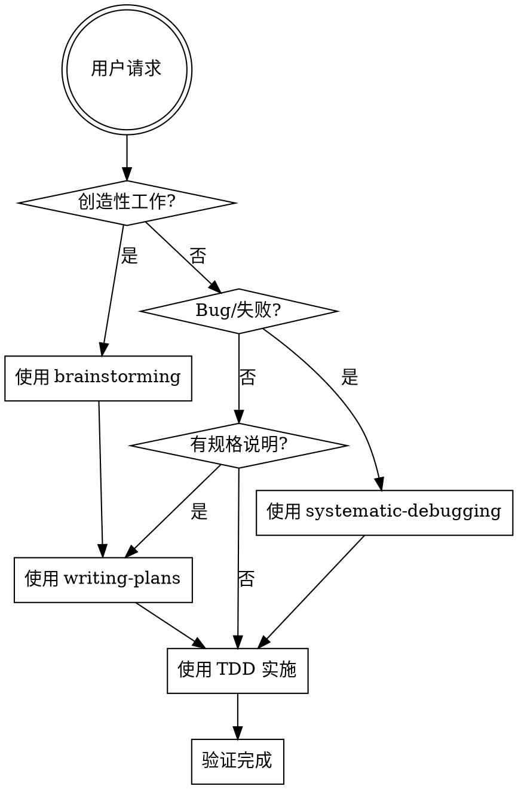
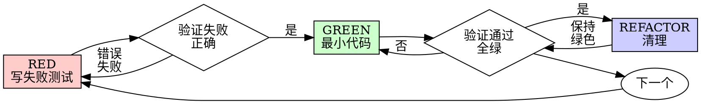
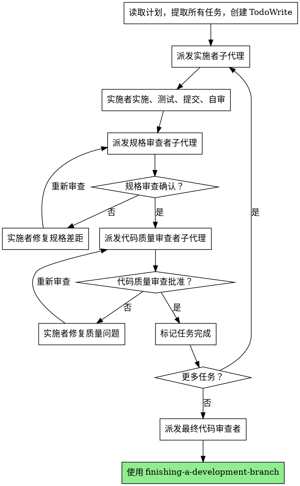

# Superpowers 学习指南

> 从零开始掌握 Agentic Coding 的核心技能框架

## 概述

**Superpowers** 是一套为 AI 编程助手设计的结构化技能框架，由 obra 开发并开源在 GitHub 上。它定义了一系列最佳实践和工作流程，帮助 AI 助手更可靠、更高效地完成软件开发任务。

**核心理念：** 通过强制性的流程和检查点，确保 AI 在执行任务时遵循软件工程的最佳实践，避免常见的错误和陷阱。

---

## 一、核心技能概览

Superpowers 包含 14 个核心技能，分为三大类：

### 1. 流程控制技能 (Process Skills)

| 技能名称 | 用途 | 关键原则 |
|---------|------|---------|
| **brainstorming** | 创意设计前的需求探索 | 必须在任何创造性工作之前使用 |
| **writing-plans** | 编写详细的实施计划 | 在编写代码之前先规划 |
| **executing-plans** | 在独立会话中执行计划 | 按步骤执行，不跳过验证 |
| **subagent-driven-development** | 使用子代理执行任务 | 每个任务一个新子代理 + 两阶段审查 |

### 2. 实施技能 (Implementation Skills)

| 技能名称 | 用途 | 关键原则 |
|---------|------|---------|
| **test-driven-development** | 测试驱动开发 | 先写失败的测试，再写代码 |
| **systematic-debugging** | 系统化调试 | 找到根本原因之前不修复 |
| **verification-before-completion** | 完成前验证 | 没有证据不声称完成 |

### 3. 协作技能 (Collaboration Skills)

| 技能名称 | 用途 | 关键原则 |
|---------|------|---------|
| **using-git-worktrees** | 使用 Git 工作树隔离开发 | 在隔离环境中工作 |
| **requesting-code-review** | 请求代码审查 | 完成后验证工作质量 |
| **receiving-code-review** | 接收代码审查反馈 | 技术严谨性，不盲目实施 |
| **finishing-a-development-branch** | 完成开发分支 | 合并、PR 或清理的结构化选项 |
| **dispatching-parallel-agents** | 调度并行代理 | 2+ 独立任务并行执行 |
| **writing-skills** | 编写新技能 | 创建自定义技能 |

---

## 二、核心工作流程

### 2.1 标准开发流程

```
用户请求 → brainstorming → writing-plans → subagent-driven-development/executing-plans → verification-before-completion → finishing-a-development-branch
```

### 2.2 技能优先级规则

1. **流程技能优先** (brainstorming, debugging) - 决定如何处理任务
2. **实施技能其次** (TDD, domain-specific) - 指导具体执行

### 2.3 关键决策点



---

## 三、核心技能详解

### 3.1 Brainstorming (头脑风暴)

**铁律：** 在任何创造性工作之前必须使用 - 创建功能、构建组件、添加功能或修改行为。

**流程：**

1. **探索项目上下文** - 检查文件、文档、最近提交
2. **提供可视化伴侣** (如涉及视觉问题) - 独立消息，不与其他内容混合
3. **逐一提问澄清** - 一次一个问题，理解目的/约束/成功标准
4. **提出 2-3 种方法** - 带权衡和推荐
5. **呈现设计** - 按复杂度缩放章节，每节后获取用户批准
6. **编写设计文档** - 保存到 `docs/superpowers/specs/YYYY-MM-DD-<topic>-design.md`
7. **规格自审** - 快速检查占位符、矛盾、歧义、范围
8. **用户审查书面规格** - 在继续之前请用户审查规格文件
9. **过渡到实施** - 调用 writing-plans 技能创建实施计划

**反模式：** "这太简单了，不需要设计"

**真相：** 每个项目都要经过这个过程。简单的项目更需要设计，因为未审查的假设会导致最多的浪费工作。

### 3.2 Test-Driven Development (测试驱动开发)

**铁律：** 没有失败的测试，就不写生产代码。

```
NO PRODUCTION CODE WITHOUT A FAILING TEST FIRST
```

**红-绿-重构循环：**



**关键原则：**

- 如果你没看到测试失败，你不知道它是否测试正确的东西
- 测试后写 = "这做什么？" 测试先写 = "这应该做什么？"
- 测试后写会立即通过，证明不了任何事

**常见合理化借口：**

| 借口 | 现实 |
|-----|------|
| "太简单了不需要测试" | 简单代码也会出错。测试只需 30 秒。 |
| "我之后会测试" | 立即通过的测试证明不了任何事。 |
| "已经手动测试了" | 临时的 ≠ 系统的。没有记录，无法重跑。 |
| "删除 X 小时的工作是浪费" | 沉没成本谬误。保留未验证的代码是技术债务。 |

### 3.3 Systematic Debugging (系统化调试)

**铁律：** 没有根本原因调查，就不修复。

```
NO FIXES WITHOUT ROOT CAUSE INVESTIGATION FIRST
```

**四个阶段：**

#### 阶段 1：根本原因调查

1. **仔细阅读错误消息** - 不要跳过错误或警告
2. **一致地重现** - 能可靠触发吗？确切步骤是什么？
3. **检查最近更改** - Git diff、最近提交、新依赖
4. **在多组件系统中收集证据** - 在每个组件边界添加诊断
5. **追踪数据流** - 坏值从哪里来？

#### 阶段 2：模式分析

1. **找到工作示例** - 类似的工作代码在哪里？
2. **对比参考** - 完整阅读参考实现
3. **识别差异** - 列出每个差异
4. **理解依赖** - 需要什么其他组件？

#### 阶段 3：假设和测试

1. **形成单一假设** - 明确陈述
2. **最小测试** - 一次一个变量
3. **验证后继续** - 有效 → 阶段 4；无效 → 新假设
4. **不知道时** - 说"我不理解 X"

#### 阶段 4：实施

1. **创建失败测试用例** - 最简单的重现
2. **实施单一修复** - 一次一个更改
3. **验证修复** - 测试通过？其他测试没坏？
4. **如果修复无效** - 停止，计数尝试次数
5. **如果 3+ 次修复失败** - 质疑架构

**红旗信号：**

- "快速修复，稍后调查"
- "只是尝试改变 X 看看是否有效"
- "一次添加多个更改，运行测试"
- "跳过测试，我会手动验证"

### 3.4 Verification Before Completion (完成前验证)

**铁律：** 没有新鲜验证证据，就不声称完成。

```
NO COMPLETION CLAIMS WITHOUT FRESH VERIFICATION EVIDENCE
```

**门控函数：**

```
在声称任何状态或表达满意之前：

1. 识别：什么命令证明这个声明？
2. 运行：执行完整命令（新鲜、完整）
3. 阅读：完整输出，检查退出码，计算失败
4. 验证：输出确认声明吗？
   - 如果否：陈述实际状态和证据
   - 如果是：陈述声明和证据
5. 只有这样：做出声明

跳过任何步骤 = 撒谎，不是验证
```

**常见失败：**

| 声明 | 需要 | 不充分 |
|-----|------|--------|
| 测试通过 | 测试命令输出：0 失败 | 之前运行，"应该通过" |
| Linter 干净 | Linter 输出：0 错误 | 部分检查，推断 |
| 构建成功 | 构建命令：退出 0 | Linter 通过，日志看起来不错 |
| Bug 修复 | 测试原始症状：通过 | 代码改变，假设修复 |

### 3.5 Writing Plans (编写计划)

**目标：** 编写全面的实施计划，假设工程师对代码库零上下文。

**文件结构：**

在定义任务之前，规划哪些文件将被创建或修改，每个文件负责什么。

**任务粒度：**

每个步骤是一个动作（2-5 分钟）：
- "写失败测试" - 步骤
- "运行以确保失败" - 步骤
- "实施最小代码使测试通过" - 步骤
- "运行测试确保通过" - 步骤
- "提交" - 步骤

**禁止占位符：**

- "TBD", "TODO", "稍后实施", "填写细节"
- "添加适当的错误处理" / "添加验证" / "处理边缘情况"
- "为上述编写测试"（没有实际测试代码）
- "类似于任务 N"（重复代码）

**执行交接：**

计划完成后，提供执行选择：

1. **子代理驱动（推荐）** - 每个任务派发新子代理，任务间审查
2. **内联执行** - 在此会话中使用 executing-plans 执行

### 3.6 Subagent-Driven Development (子代理驱动开发)

**核心原则：** 每个任务一个新子代理 + 两阶段审查（规格然后质量）= 高质量，快速迭代

**流程：**



**模型选择：**

- **机械实施任务**（隔离函数、清晰规格、1-2 文件）：使用快速、便宜的模型
- **集成和判断任务**（多文件协调、模式匹配、调试）：使用标准模型
- **架构、设计和审查任务**：使用最强大的可用模型

---

## 四、技能使用规则

### 4.1 强制性规则

1. **即使只有 1% 的可能性技能适用，也必须调用技能**
2. **技能检查在任何响应或操作之前**
3. **用户指令优先级最高** - AGENTS.md > Superpowers > 默认系统提示

### 4.2 红旗信号

这些想法意味着停止 - 你在合理化：

| 想法 | 现实 |
|-----|------|
| "这只是一个简单的问题" | 问题是任务。检查技能。 |
| "我需要更多上下文" | 技能检查在澄清问题之前。 |
| "让我先探索代码库" | 技能告诉你如何探索。先检查。 |
| "我可以快速检查 git/文件" | 文件缺乏对话上下文。检查技能。 |
| "让我先收集信息" | 技能告诉你如何收集信息。 |
| "这不需要正式技能" | 如果存在技能，使用它。 |
| "我记得这个技能" | 技能会演变。阅读当前版本。 |
| "这不算任务" | 行动 = 任务。检查技能。 |
| "技能是过度杀伤" | 简单的事情会变复杂。使用它。 |
| "我只是先做这一件事" | 在做任何事之前检查。 |
| "这感觉有成效" | 不受纪律的行动浪费时间。技能防止这种情况。 |

### 4.3 平台适配

技能使用 Claude Code 工具名称。其他平台：

- `TodoWrite` → `todowrite`
- `Task` 工具与子代理 → 使用 OpenCode 的子代理系统
- `Skill` 工具 → OpenCode 的原生 `skill` 工具
- `Read`, `Write`, `Edit`, `Bash` → 原生工具

---

## 五、最佳实践

### 5.1 文件组织

```
project/
├── .opencode/
│   └── skills/
│       └── custom-skill/
│           └── SKILL.md
├── docs/
│   └── superpowers/
│       ├── specs/          # 设计文档
│       ├── plans/          # 实施计划
│       └── archive/        # 已完成的计划
└── AGENTS.md               # 项目指令
```

### 5.2 技能文件格式

```markdown
---
name: skill-name
description: 简洁描述（1-1024 字符）
license: MIT
compatibility: opencode
metadata:
  audience: developers
  workflow: custom
---

# 技能标题

## 概述
...

## 流程
...

## 检查清单
...
```

### 5.3 常用命令

```bash
# 初始化项目
/init

# 连接提供商
/connect

# 撤销更改
/undo

# 重做更改
/redo

# 分享会话
/share
```

---

## 六、实际应用示例

### 6.1 添加新功能

```
用户: "添加用户认证功能"

AI: [检查技能] → 使用 brainstorming
    → 探索项目上下文
    → 提问澄清需求
    → 提出 2-3 种方法
    → 呈现设计
    → 编写设计文档
    → 用户审查
    → 调用 writing-plans
    → 创建实施计划
    → 选择执行方式
    → 使用 TDD 实施
    → 验证完成
    → 使用 finishing-a-development-branch
```

### 6.2 修复 Bug

```
用户: "测试失败了"

AI: [检查技能] → 使用 systematic-debugging
    → 阶段 1：根本原因调查
    → 阶段 2：模式分析
    → 阶段 3：假设和测试
    → 阶段 4：实施（使用 TDD）
    → 验证完成
```

### 6.3 代码审查

```
用户: "审查这个 PR"

AI: [检查技能] → 使用 receiving-code-review
    → 技术严谨性验证
    → 不盲目实施建议
    → 如有疑问，提问澄清
```

---

## 七、常见问题

### Q1: 什么时候使用 brainstorming？

**A:** 在任何创造性工作之前 - 创建功能、构建组件、添加功能或修改行为。即使看起来很简单。

### Q2: 什么时候使用 TDD？

**A:** 在实施任何功能或 bug 修复之前，编写实现代码之前。例外：一次性原型、生成代码、配置文件（需询问用户）。

### Q3: 什么时候使用 systematic-debugging？

**A:** 遇到任何 bug、测试失败或意外行为时，在提出修复之前。

### Q4: 如何选择执行方式？

**A:**
- **子代理驱动**：任务独立，需要高质量，在当前会话
- **执行计划**：在并行会话中执行
- **手动执行**：任务紧密耦合

### Q5: 如何验证完成？

**A:** 运行验证命令，阅读完整输出，确认退出码和失败计数，然后才声称完成。

---

## 八、资源链接

- **GitHub 仓库**: https://github.com/obra/superpowers
- **OpenCode 文档**: https://opencode.ai/docs
- **技能文档**: https://opencode.ai/docs/skills
- **Discord 社区**: https://opencode.ai/discord

---

## 九、总结

Superpowers 是一套强大的 AI 编程助手技能框架，通过强制性的流程和检查点，确保：

1. **设计先行** - brainstorming 确保充分理解需求
2. **测试驱动** - TDD 确保代码质量和可维护性
3. **系统调试** - systematic-debugging 确保找到根本原因
4. **验证完成** - verification-before-completion 确保声称有据
5. **结构化执行** - writing-plans 和 subagent-driven-development 确保有序实施

**核心原则：** 遵循流程，不跳过步骤，证据优先于声称。

---

*文档版本: 1.0*
*最后更新: 2026-05-09*
*来源: Superpowers GitHub 仓库 + OpenCode 官方文档*
